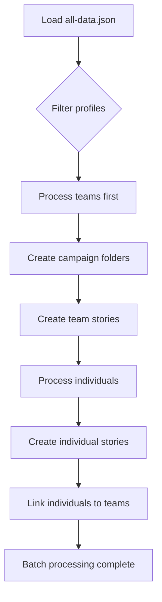
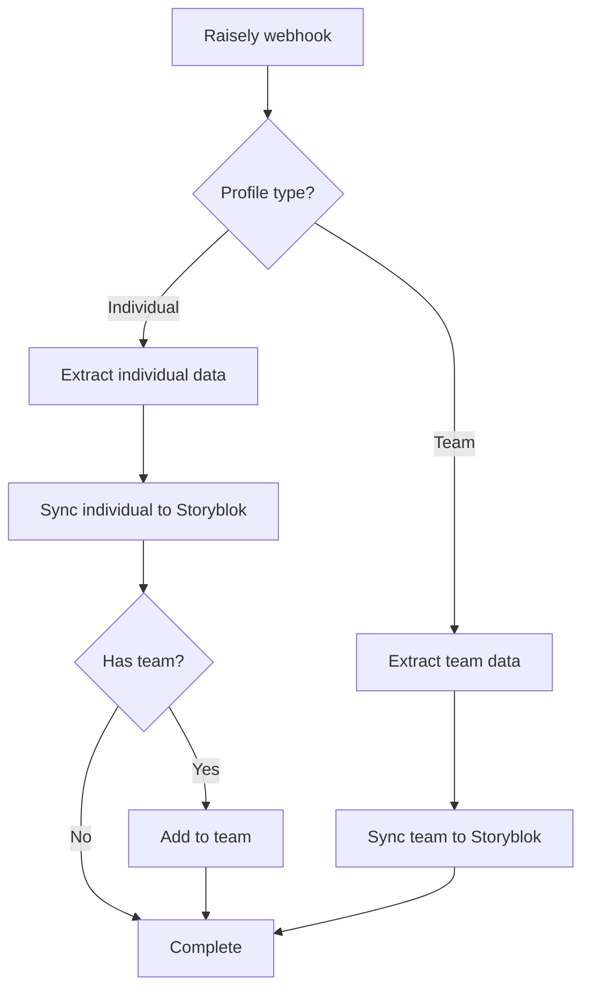

# Architecture Documentation

## System Overview

The Raisely to Storyblok Importer is designed to synchronize fundraising data between two systems while maintaining data integrity and preventing race conditions.

## Data Flow

### 1. Bulk Import Process



**Key Points:**
- Teams are always processed before individuals
- Sequential processing prevents race conditions
- Folder structure is created automatically
- Team members are added one at a time

### 2. Webhook Process



**Key Points:**
- Real-time processing
- Automatic team linking
- Preserves existing data
- Handles both creation and updates

## Component Architecture

### Core Services

#### StoryblokService
- **Purpose**: Handles all Storyblok API interactions
- **Key Methods**:
  - `syncFundraiser()` - Create/update individual profiles
  - `syncTeam()` - Create/update team profiles  
  - `addTeamMember()` - Add individuals to teams
- **Race Condition Prevention**: Always fetches fresh data before updates

#### WebhookController
- **Purpose**: Processes incoming Raisely webhooks
- **Responsibilities**:
  - Validate webhook data
  - Extract profile information
  - Route to appropriate sync methods
- **Security**: Validates webhook secrets

### Data Layer

#### Profile Types
```javascript
// Individual Profile
{
  type: 'INDIVIDUAL',
  isCampaignProfile: false,
  parent: { /* team data */ }
}

// Team Profile  
{
  type: 'GROUP',
  isCampaignProfile: false,
  /* no parent */
}

// Campaign Profile (ignored)
{
  type: 'GROUP', 
  isCampaignProfile: true
}
```

#### Storyblok Structure
```
📁 fundraisers/
├── 📁 campaign-1/
│   ├── 📄 campaign-1 (campaign story)
│   ├── 📁 team/
│   │   ├── 📄 team-alpha (team story)
│   │   └── 📄 team-beta (team story)  
│   ├── 📄 individual-1 (individual story)
│   └── 📄 individual-2 (individual story)
📁 events/
├── 📄 event-campaign-1 (event story)
├── 📄 event-campaign-2 (event story)
```

## Race Condition Prevention

### Problem
When multiple individuals from the same team are processed simultaneously, they can:
1. Read the same team state (e.g., 2 members)
2. Each add themselves (resulting in 3 members)
3. Both write back their version (only one survives)
4. Result: Only one new member is actually added

### Solution
The system implements several layers of protection:

#### 1. Sequential Team Processing
```javascript
// Group profiles by team
const teamGroups = new Map();
for (const profile of batch) {
  if (hasTeam(profile)) {
    const teamKey = `${profile.parent.name}-${profile.parent.path}`;
    teamGroups.get(teamKey).push(profile);
  }
}

// Process each team's members sequentially
for (const [teamKey, teamMembers] of teamGroups) {
  for (const member of teamMembers) {
    await processProfile(member); // Sequential, not parallel
  }
}
```

#### 2. Fresh Data Fetching
```javascript
async addTeamMember(teamName, campaignName, memberUuid) {
  // Always get the latest team state
  const fullStoryResponse = await this.client.get(`spaces/${this.spaceId}/stories/${teamStory.id}`);
  const fullTeamStory = fullStoryResponse.data.story;
  
  const currentMembers = fullTeamStory.content.team || [];
  // ... proceed with current state
}
```

#### 3. Data Preservation
All update operations preserve existing data:
```javascript
const updateData = {
  story: {
    content: {
      ...fullTeamStory.content, // Preserve all existing fields
      team: updatedMembers       // Only update team members
    }
  }
};
```

## Error Handling

### Validation Layers
1. **Webhook validation** - Ensures required fields exist
2. **Data extraction** - Handles missing or malformed data
3. **API error handling** - Retries and graceful degradation
4. **Type preservation** - Ensures content types remain intact

### Logging Strategy
- **Concise by default** - Only shows progress and results
- **Verbose mode** - Shows detailed step-by-step processing
- **Error details** - Full stack traces in development mode
- **Progress tracking** - Real-time batch progress updates

## Performance Considerations

### Batch Processing
- **Default batch size**: 5 profiles (configurable)
- **Inter-batch delay**: 1000ms (configurable)
- **Rate limiting**: Prevents API overload

### Optimizations
- **Folder caching**: Reuses folder lookups within batches
- **Story caching**: Minimizes API calls for team lookups
- **Parallel processing**: Safe parallelization where possible

## Security

### Webhook Security
- Secret validation for incoming webhooks
- Request signature verification
- Environment-based secret management

### API Security
- Management API tokens stored in environment
- No hardcoded credentials
- Token rotation support

## Monitoring & Debugging

### Health Checks
- `/health` endpoint for uptime monitoring
- Environment variable validation on startup
- Database connection testing

### Debug Capabilities
- Dry-run mode for safe testing
- Verbose logging for troubleshooting
- Test endpoints for webhook simulation
- Detailed error reporting with context